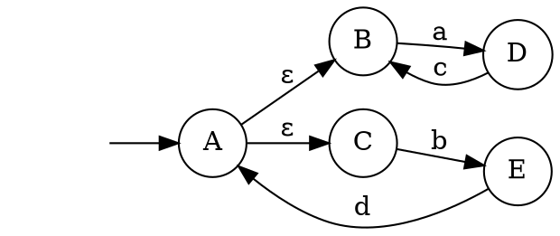

# TP4 Docker Containers

## 1. Alpine Container with Graphviz

### Steps:
1. Create a working directory:
```bash
mkdir ~/TP4
cd ~/TP4
```

2. Create Dockerfile:

```dockerfile
FROM alpine:latest
RUN apk add --no-cache graphviz
RUN mkdir /Data
WORKDIR /Data
```

3. Build the image:
```bash
docker build -f DockerfileAutomate -t graphviz-container .
```

4. Create automate.dot:


5. Generate PDF:
```bash
docker run -v "$(pwd):/Data" -w /Data graphviz-container dot -Tpdf -o automate.pdf automate.dot
```

## 2. Alpine Container for Apache with UserDir

### Steps:
1. Create DockerfileApache2:
```dockerfile
FROM alpine:latest

RUN apk add --no-cache apache2

RUN adduser -D toto && \
    mkdir /home/toto/public_html && \
    chown toto:toto /home/toto/public_html

COPY userdir.conf /etc/apache2/conf.d/userdir.conf

VOLUME /home/toto/public_html

EXPOSE 80

CMD ["httpd", "-D", "FOREGROUND"]
```

2. Create userdir.conf:
```apache
LoadModule userdir_module modules/mod_userdir.so
UserDir public_html
UserDir disabled root
<Directory "/home/*/public_html">
    AllowOverride All
    Options Indexes FollowSymLinks
    Require all granted
</Directory>
```

3. Setup and run:
```bash
mkdir public_html
echo "Hello, World" > public_html/index.html
docker build -f DockerfileApache2 -t apache-container .
docker run -d -p 8080:80 -v "$(pwd)/public_html:/home/toto/public_html" apache-container
```
